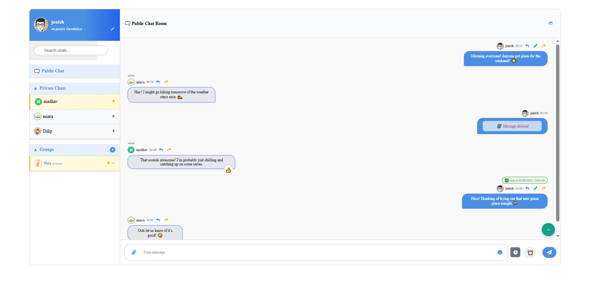
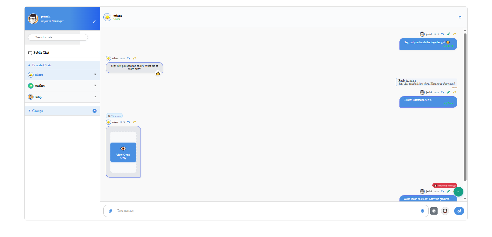
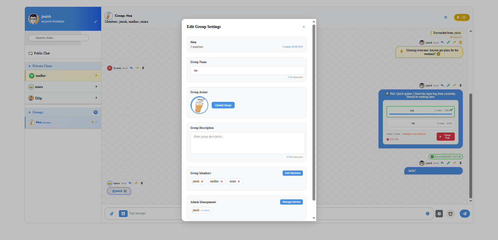
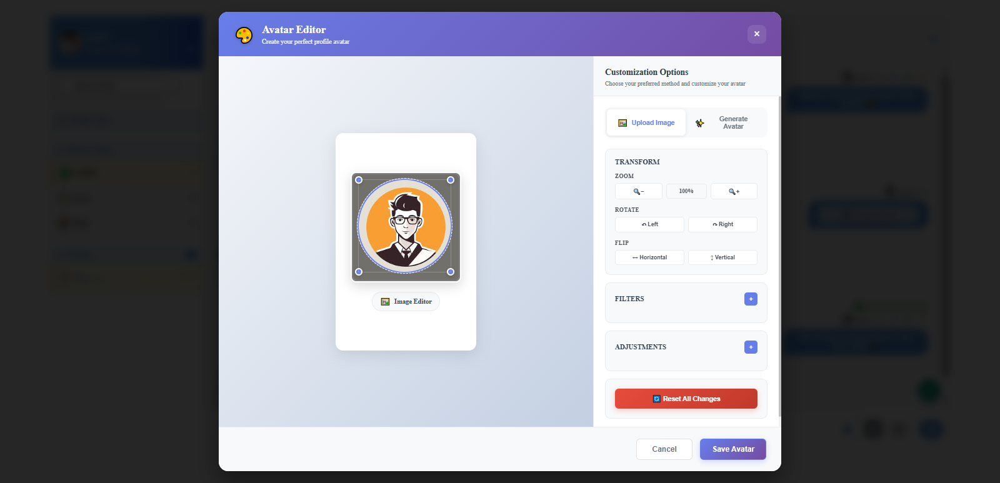
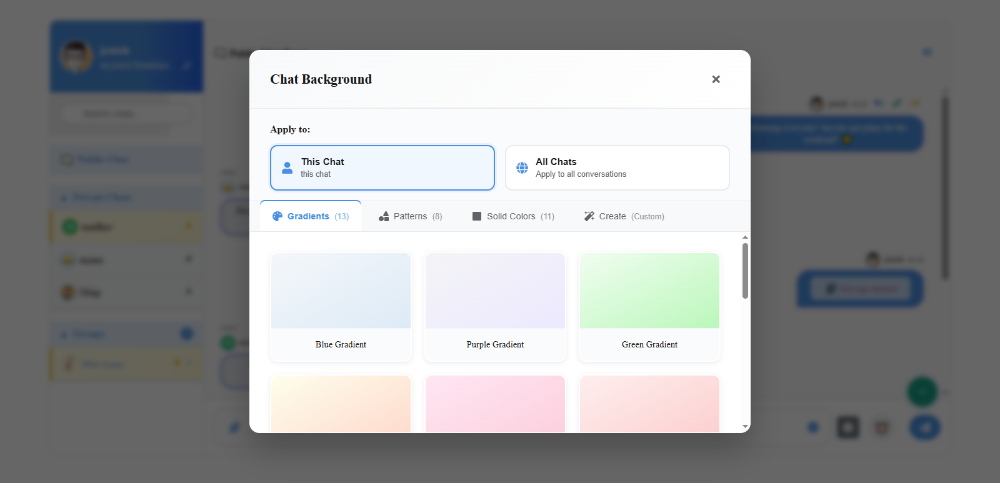

# 🚀 Socket.IO Real-Time Chat Application

A modern, feature-rich real-time chat application built with React, Node.js, and Socket.IO. This application supports private messaging, group chats, file sharing, polls, and comprehensive admin functionality.


## 📋 Table of Contents

- [✨ Features](#-features)
- [🛠️ Technology Stack](#️-technology-stack)
- [📸 Screenshots](#-screenshots)
- [🚀 Quick Start](#-quick-start)
- [🏗️ Development Process](#️-development-process)
- [📱 Features Overview](#-features-overview)
- [🔧 API Documentation](#-api-documentation)
- [🔒 Security Features](#-security-features)
- [📦 Project Structure](#-project-structure)
- [🤝 Contributing](#-contributing)

## ✨ Features

### 💬 **Core Chat Features**
- **Real-time messaging** with Socket.IO
- **Private conversations** between users
- **Group chats** with admin management
- **Public chat room** for all users
- **Message reactions** (emojis) with 6 predefined reactions
- **Message editing** and deletion
- **Message forwarding** to other chats
- **Reply to messages** with context
- **Message pinning** in groups
- **System messages** for group events
- **Message scheduling** for future delivery
- **Temporary messages** with auto-deletion
- **View-once messages** for privacy
- **Mention system** (@username and @all)
- **Message search** functionality
- **Typing indicators** in real-time
- **Read receipts** and message status
- **Message timestamps** and edit history

### 👥 **User Management**
- **User registration** and authentication
- **Profile customization** with avatars
- **Bio editing** functionality
- **Online/offline status** indicators
- **User search** and discovery
- **Advanced avatar editor** with:
  - Image cropping and rotation
  - 15+ filter presets (sepia, vintage, dramatic, etc.)
  - Manual adjustments (brightness, contrast, saturation)
  - Auto-generated avatars with color schemes
  - Font style customization
  - Flip and scale controls
- **Interactive login experience** with animated monkey character

### 🏢 **Group Management**
- **Create groups** with multiple members
- **Admin hierarchy** (Creator → Admins → Members)
- **Admin permissions** management
- **Group settings** (name, description, avatar)
- **Member management** (add/remove)
- **Group deletion** (creator only)
- **Visual admin indicators** in sidebar
- **Group avatar editor** with same features as user avatars
- **Group description editing**
- **Group name changes** with automatic message updates
- **System notifications** for member additions

### 📊 **Interactive Features**
- **Advanced poll system** with:
  - Multiple choice questions
  - Up to 10 options per poll
  - Multiple vote support
  - Poll expiration dates
  - Real-time voting updates
  - Poll results visualization
  - Poll management (close, view results)
- **File sharing** (images, videos, documents)
- **Media viewer** with full-screen support
- **Background customization** with:
  - 15+ built-in gradient backgrounds
  - Pattern backgrounds (dots, etc.)
  - Custom color schemes
  - Per-chat background settings

### 🎨 **UI/UX Features**
- **Responsive design** for all devices
- **Dark/Light theme** support
- **Custom chat backgrounds**
- **Emoji picker** integration
- **Typing indicators**
- **Message timestamps** and read receipts
- **Chat pinning** for quick access
- **Search functionality** across chats
- **Mobile-optimized** interface
- **Toast notifications** system
- **Modal system** for various actions
- **Sidebar navigation** with collapsible design
- **Smooth animations** and transitions

### 🔒 **Advanced Features**
- **Temporary messages** with auto-deletion
- **View-once messages** for privacy
- **Message scheduling** for future delivery
- **Mention system** (@username and @all)
- **Message reactions** with emoji
- **File upload** with progress tracking
- **Real-time notifications**
- **Message expiration** system
- **Scheduled message processing**
- **Auto-cleanup** of expired content

## 🛠️ Technology Stack

### **Frontend**
- **React 19.1.0** - Modern UI framework
- **Vite 7.0.0** - Fast build tool and dev server
- **Socket.IO Client 4.8.1** - Real-time communication
- **CSS3** - Custom styling with animations
- **React Icons 5.5.0** - Icon library
- **Emoji Picker 4.13.2** - Emoji selection component
- **React Router DOM 7.6.3** - Client-side routing
- **React Toastify 11.0.5** - Toast notifications
- **Fabric.js 6.7.1** - Canvas manipulation for avatar editor
- **React Colorful 5.6.1** - Color picker component

### **Backend**
- **Node.js** - JavaScript runtime
- **Express.js 5.1.0** - Web framework
- **Socket.IO 4.8.1** - Real-time bidirectional communication
- **MongoDB** - NoSQL database
- **Mongoose 8.16.3** - MongoDB object modeling
- **Multer 1.4.5** - File upload handling
- **CORS 2.8.5** - Cross-origin resource sharing
- **JWT 9.0.2** - JSON Web Token authentication
- **bcryptjs 3.0.2** - Password hashing
- **Cloudinary 2.4.0** - Cloud file storage

### **Development Tools**
- **ESLint** - Code linting
- **Git** - Version control
- **npm** - Package management

## 📸 Screenshots

### **🎯 Application Overview**


*Public Chat Interface - Real-time messaging with reactions, typing indicators, and modern UI*

### **💬 Chat Types & Features**

| Private Chat | Group Chat |
|--------------|------------|
|  |  |
| *Secure one-on-one conversations with advanced message features* | *Team collaboration with polls, admin controls, and member management* |

### **🎨 Advanced Features**

| Avatar Editor | Background Customization |
|---------------|---------------------------|
|  |  |
| *Professional image editing with 15+ filters and customization options* | *15+ gradient backgrounds and pattern options for personalization* |

### **🔍 Feature Highlights**

| Feature | Screenshot | Description |
|---------|------------|-------------|
| **Public Chat** |  | Real-time messaging with reactions, typing indicators, and modern UI |
| **Private Chat** |  | Secure one-on-one conversations with advanced message features |
| **Group Chat** |  | Team collaboration with polls, admin controls, and member management |
| **Avatar Editor** |  | Professional image editing with 15+ filters and customization options |
| **Background Customization** |  | 15+ gradient backgrounds and pattern options for personalization |

---

## 🚀 Quick Start

### **Prerequisites**
- Node.js (v18 or higher)
- MongoDB (local or Atlas)
- Git

### **Installation**

1. **Clone the repository**
   ```bash
   git clone <repository-url>
   ```

2. **Set up environment variables**
   ```bash
   # Backend
   cp backend/env.example backend/.env
   # Edit backend/.env with your values
   
   # Frontend
   cp frontend/env.example frontend/.env
   # Edit frontend/.env with your values
   ```

3. **Install dependencies**
   ```bash
   # Backend
   cd backend
   npm install
   
   # Frontend
   cd ../frontend
   npm install
   ```

4. **Start the application**
   ```bash
   # Backend (Terminal 1)
   cd backend
   npm start
   
   # Frontend (Terminal 2)
   cd frontend
   npm run dev
   ```

5. **Access the application**
   - Frontend: http://localhost:5173
   - Backend: http://localhost:5000

## 🏗️ Development Process

### **Phase 1: Foundation Setup**
1. **Project Structure**
   - Initialize React app with Vite
   - Set up Node.js backend with Express
   - Configure MongoDB connection
   - Set up Socket.IO server

2. **Basic Authentication**
   - User registration system
   - Login/logout functionality
   - JWT token management
   - User session handling

### **Phase 2: Core UI Components**
1. **Sidebar Development**
   - User profile section
   - Chat list (private + groups)
   - Search functionality
   - Online status indicators
   - Chat pinning system

2. **Chat Interface**
   - Message display area
   - Message input with emoji support
   - File upload interface
   - Typing indicators
   - Message timestamps

3. **Message Components**
   - Message bubbles (sent/received)
   - Message actions (edit, delete, forward)
   - Message reactions
   - Reply preview
   - Media message display

### **Phase 3: Real-time Communication**
1. **Socket.IO Integration**
   - Real-time message sending
   - Online user tracking
   - Typing indicators
   - Message delivery status
   - Connection management

2. **Chat Functionality**
   - Private messaging
   - Group chat creation
   - Message history loading
   - Real-time updates
   - Message synchronization

### **Phase 4: Advanced Features**
1. **Group Management**
   - Group creation interface
   - Member management
   - Admin system implementation
   - Group settings modal
   - Admin permissions

2. **File Sharing**
   - File upload system
   - Media preview
   - File type validation
   - Upload progress tracking
   - Media viewer component

3. **Interactive Features**
   - Poll creation system
   - Voting mechanism
   - Poll results display
   - Message reactions
   - Emoji picker integration

### **Phase 5: Enhanced UX**
1. **UI/UX Improvements**
   - Responsive design
   - Mobile optimization
   - Background customization
   - Theme support
   - Animation effects

2. **Advanced Messaging**
   - Message editing
   - Message forwarding
   - Reply system
   - Message pinning
   - Temporary messages

### **Phase 6: Security & Polish**
1. **Security Implementation**
   - Input validation
   - File upload security
   - Admin permission checks
   - Error handling
   - Rate limiting

2. **Final Features**
   - Message scheduling
   - View-once messages
   - Mention system
   - Search functionality
   - Performance optimization

## 📱 Features Overview

### **🔐 Authentication System**
```
User Registration → Login → JWT Token → Session Management
```

### **💬 Messaging Flow**
```
Message Input → Socket.IO → Database → Real-time Broadcast → UI Update
```

### **👥 Group Management**
```
Create Group → Add Members → Assign Admins → Manage Permissions → Group Operations
```

### **📊 Poll System**
```
Create Poll → Add Options → Real-time Voting → Results Display → Poll Management
```

### **📁 File Sharing**
```
File Selection → Upload Progress → Server Storage → Media Preview → Share in Chat
```

## 🔧 API Documentation

### **Authentication Endpoints**
```http
POST /api/auth/register - User registration
POST /api/auth/login - User login
PATCH /api/auth/update-profile - Update user profile (bio, avatar)
```

### **Group Management Endpoints**
```http
POST /api/group - Create group
PUT /api/group-name - Update group name
PUT /api/group-description - Update group description
PUT /api/group-members - Update group members
POST /api/leave-group - Leave group
DELETE /api/group - Delete group
POST /api/group-members - Add/remove members
```

### **Avatar & Media Endpoints**
```http
POST /api/avatar - Upload user avatar
POST /api/group-avatar - Upload group avatar
POST /api/upload - Upload files (images, videos, documents)
```

### **Background Endpoints**
```http
GET /api/backgrounds/list - Get available backgrounds
```

### **Poll Endpoints**
```http
POST /api/polls - Create poll
PUT /api/polls/:id/vote - Vote on poll
PUT /api/polls/:id/close - Close poll
```

### **Socket.IO Events**
```javascript
// Client to Server
'send_message' - Send a message
'edit_message' - Edit a message
'delete_message' - Delete a message
'create_group' - Create a group
'join_group' - Join a group
'leave_group' - Leave a group
'typing' - User typing indicator
'stop_typing' - Stop typing indicator
'create_poll' - Create a poll
'vote_poll' - Vote on a poll
'close_poll' - Close a poll
'pin_message' - Pin a message
'unpin_message' - Unpin a message
'add_reaction' - Add message reaction
'view_once_image' - View once image
'add_admin' - Add group admin
'remove_admin' - Remove group admin

// Server to Client
'receive_message' - Receive a message
'message_edited' - Message was edited
'message_deleted' - Message was deleted
'user_joined' - User joined chat
'user_left' - User left chat
'typing' - User is typing
'stop_typing' - User stopped typing
'poll_created' - New poll created
'poll_voted' - Poll vote received
'poll_closed' - Poll was closed
'message_pinned' - Message was pinned
'message_unpinned' - Message was unpinned
'groups_list' - Updated groups list
'users_list' - Updated users list
'message_expired' - Temporary message expired
```

## 🔒 Security Features

- **JWT Authentication** - Secure token-based auth
- **Input Validation** - Server-side validation
- **File Upload Security** - Type and size validation
- **Admin Permissions** - Role-based access control
- **CORS Protection** - Cross-origin security
- **Environment Variables** - Secure configuration
- **Rate Limiting** - API protection
- **SQL Injection Prevention** - Database security

## 📦 Project Structure

```
socket.io/
├── frontend/                 # React frontend
│   ├── src/
│   │   ├── components/      # Reusable components
│   │   │   ├── AnimatedMonkey/     # Interactive login character
│   │   │   ├── AvatarEditor/       # Advanced avatar editor
│   │   │   ├── BackgroundSelector/ # Chat background customization
│   │   │   ├── ChatRoom/           # Chat interface components
│   │   │   ├── CreatePollModal.jsx # Poll creation modal
│   │   │   ├── Poll.jsx            # Poll display component
│   │   │   └── ToastContainer.jsx  # Notification system
│   │   ├── pages/          # Page components
│   │   │   ├── ChatRoom/   # Main chat room page
│   │   │   └── Login/      # Authentication page
│   │   ├── utils/          # Utility functions
│   │   │   └── avatarUtils.jsx # Avatar rendering utilities
│   │   └── assets/         # Static assets
│   ├── public/             # Public files
│   └── package.json
├── backend/                 # Node.js backend
│   ├── controllers/        # Route controllers
│   │   ├── groupController.js  # Group management logic
│   │   ├── pollController.js   # Poll system logic
│   │   ├── socketController.js # Real-time communication
│   │   └── uploadController.js # File upload handling
│   ├── models/            # Database models
│   │   ├── Group.js       # Group schema
│   │   ├── Message.js     # Message schema
│   │   ├── Poll.js        # Poll schema
│   │   └── User.js        # User schema
│   ├── routes/            # API routes
│   │   ├── auth.js        # Authentication routes
│   │   ├── avatar.js      # Avatar management
│   │   ├── background.js  # Background system
│   │   ├── group*.js      # Group management routes
│   │   ├── poll.js        # Poll routes
│   │   └── upload.js      # File upload routes
│   ├── middleware/        # Custom middleware
│   │   ├── errorHandler.js    # Error handling
│   │   └── socketMiddleware.js # Socket.IO middleware
│   ├── uploads/           # File uploads
│   └── package.json
├── .gitignore             # Git ignore rules
└── README.md              # This file
```

## 🎯 **Unique Features**

### **🐵 Interactive Login Experience**
- **Animated Monkey Character**: Delightful animated monkey that reacts to user interactions
- **State-based Animations**: Idle, typing, success, error, and loading states
- **Contextual Messages**: Dynamic messages based on user actions
- **Responsive Design**: Adapts to different screen sizes

### **🎨 Advanced Avatar System**
- **Professional Image Editor**: Crop, rotate, flip, and scale images
- **15+ Filter Presets**: Sepia, vintage, dramatic, cool, warm, and more
- **Manual Adjustments**: Fine-tune brightness, contrast, saturation, and hue
- **Auto-generated Avatars**: Create avatars from initials with color schemes
- **Font Customization**: Multiple font styles for text-based avatars

### **📊 Comprehensive Poll System**
- **Multiple Choice Questions**: Up to 10 options per poll
- **Flexible Voting**: Support for single or multiple votes
- **Expiration Dates**: Set automatic poll closure
- **Real-time Updates**: Live voting results
- **Visual Results**: Percentage-based result display

### **🔄 Advanced Message Features**
- **Message Scheduling**: Send messages at future dates/times
- **Temporary Messages**: Auto-delete after specified duration
- **View-once Messages**: Disappear after being viewed
- **Mention System**: @username and @all mentions
- **Message Reactions**: 6 predefined emoji reactions
- **Message Pinning**: Pin important messages in groups

### **🎨 Background Customization**
- **15+ Built-in Gradients**: Blue, purple, green, orange, pink, and more
- **Pattern Backgrounds**: Dots and other geometric patterns
- **Per-chat Settings**: Different backgrounds for different chats
- **Custom Color Schemes**: Personalized color combinations

## 🤝 Contributing

### **Development Setup**
1. Fork the repository
2. Create a feature branch
3. Make your changes
4. Test thoroughly
5. Submit a pull request

### **Code Standards**
- Follow ESLint rules
- Use meaningful commit messages
- Add comments for complex logic
- Test all new features
- Update documentation

### **Testing Checklist**
- [ ] User authentication works
- [ ] Real-time messaging functions
- [ ] File uploads work correctly
- [ ] Group management features
- [ ] Admin permissions work
- [ ] Mobile responsiveness
- [ ] Cross-browser compatibility

---

## 📞 Support

For questions, issues, or contributions:
- Create an issue on GitHub
- Check the documentation
- Review the code comments
- Test in development environment

---

**Built with ❤️ using React, Node.js, and Socket.IO**

*This project demonstrates modern web development practices with real-time communication, comprehensive user management, and advanced chat features.* 